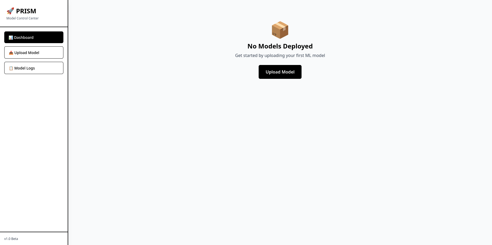
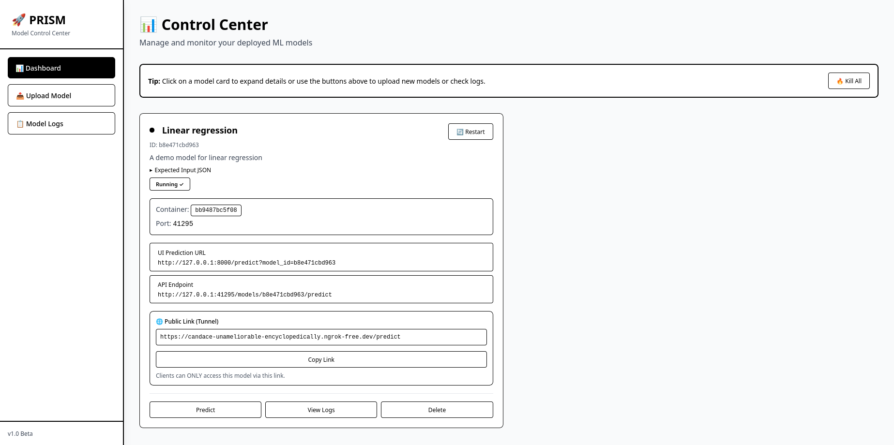
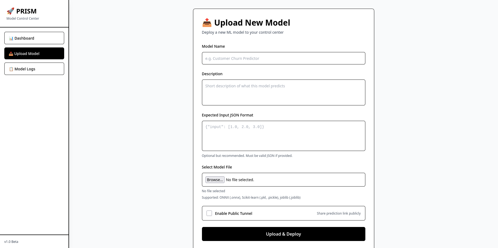
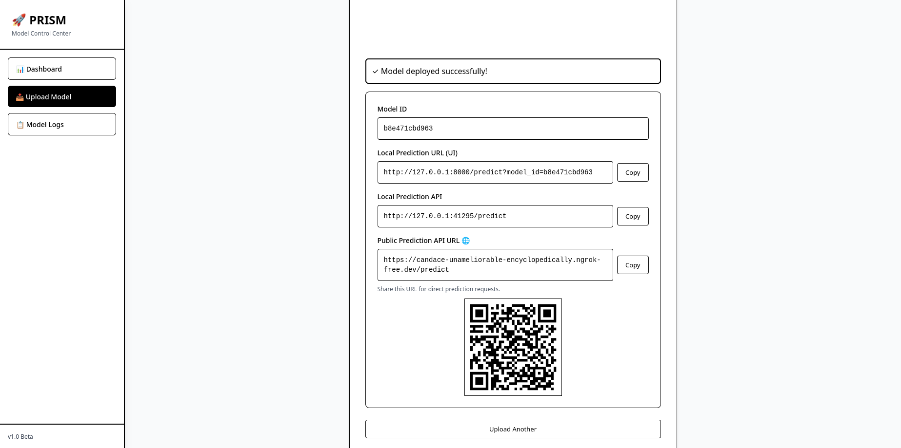
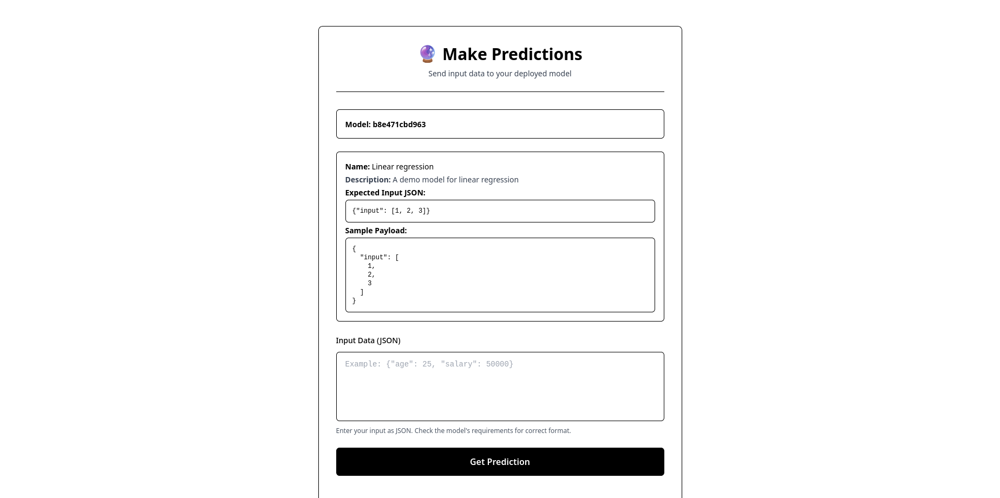
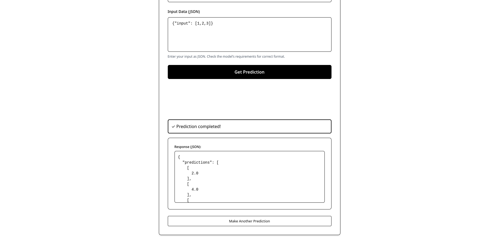
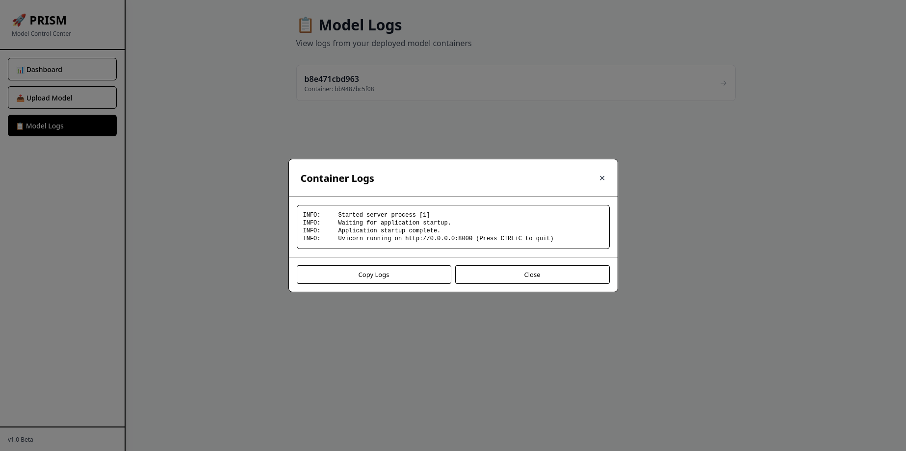

# PRISM

**Predictive Runtime and Inference Serving Module**

PRISM is a local-first model serving platform that lets you upload ML model artifacts, build isolated Docker runtimes automatically, and serve predictions through a unified FastAPI interface and web dashboard.

---

## Why PRISM

Most model serving tools are optimized for production clusters and cloud infrastructure. PRISM is designed for fast iteration and lightweight sharing from a single machine.

With PRISM you can:

- Upload `.pkl`, `.pickle`, `.joblib`, and `.onnx` models
- Build model-specific Docker images automatically
- Launch and manage containerized inference runtimes
- Call predictions via stable API routes
- Use a browser dashboard for deployment, logs, prediction testing, and lifecycle actions
- Optionally expose model endpoints via reverse tunnel

---

## Core Capabilities

- **Containerized model isolation**: Each deployed model runs in its own container
- **Unified inference API**: Predict through `POST /models/{model_id}/predict`
- **Model registry**: Tracks container IDs, ports, metadata, and optional tunnel URL
- **Access control**: Optional API key auth + in-memory rate limiting for public inference route
- **Health monitoring**: Background monitor can restart stopped containers and prune stale entries
- **Developer CLI**: `prism` command for running/stopping server, linting, and formatting

---

## Architecture (High Level)

```text
Client (UI / API)
       │
       ▼
PRISM FastAPI App
       │
       ├── /models/* endpoints (upload, run, list, delete, predict proxy)
       ├── /registry/* endpoints
       ├── /health/monitor endpoint
       └── Dashboard + HTMX UI routes
               │
               ▼
        Docker Model Containers
          (one per model)
```

---

## Tech Stack

- Python 3.12+
- FastAPI + Uvicorn
- Docker (for model runtime isolation)
- ONNX Runtime and scikit-learn adapters
- Poetry for dependency management
- Pytest, Ruff, Black for quality checks

---

## Prerequisites

Before running PRISM, ensure you have:

1. **Python** `>=3.12`
2. **Poetry** installed
3. **Docker** installed and daemon running
4. (Optional) **ngrok authtoken** for public tunnels

---

## Installation

```bash
poetry install
poetry shell
```

Or run commands without activating the shell:

```bash
poetry run <command>
```

---

## Quick Start

### 1) Start the PRISM server

Foreground mode:

```bash
poetry run uvicorn app.main:app --reload --host 127.0.0.1 --port 8000
```

Detached mode via CLI:

```bash
poetry run prism run 8000 --reload
```

Stop detached server:

```bash
poetry run prism stop
```

> Tip: run `pkill -f "app.core.tunnel_worker" || true
rm -rf /tmp/prism/tunnels` before uploading a model to ensure no existing tunnel is working in the background to interfere with prism's tunneling. 
### 2) Open the dashboard

Visit:

```text
http://127.0.0.1:8000/
```

### 3) Upload and run a model

Use UI route:

```text
http://127.0.0.1:8000/upload-model
```

Or API:

```bash
curl -X POST http://127.0.0.1:8000/models/upload-and-run \
  -F "file=@model_store/linear_regression.pkl" \
  -F "model_name=Linear Regression" \
  -F "model_description=Demo model" \
  -F 'expected_input_json={"feature1": 0.1}'
```

### 4) Predict

```bash
curl -X POST http://127.0.0.1:8000/models/<model_id>/predict \
  -H "Content-Type: application/json" \
  -d '{"feature1": 0.1}'
```

---

## Screenshots

### Dashboard Overview




### Upload Model Flow






### Prediction Interface





### Model Logs View



---

## API Overview

### Health

- `GET /` → basic service identity
- `GET /health/monitor` → background monitor status and last cycle metrics

### Models

- `POST /models/upload` → upload + build image only
- `POST /models/upload-and-run` → upload + build + run container + register model
- `POST /models` → alias of upload-and-run flow
- `GET /models` → list deployed models
- `GET /models/{model_id}` → model metadata
- `DELETE /models/{model_id}` → stop/remove container + delete registry record
- `POST /models/{model_id}/predict` → proxy inference request to container

### Registry

- `GET /registry` → full registry payload
- `GET /registry/{model_id}` → one model registry entry
- `POST /registry/prune-stale` → remove stale records

### Dashboard/UI Routes

- `GET /` → dashboard
- `GET /upload-model` → upload page
- `GET /model-logs` → logs page
- `GET /predict?model_id=...` → prediction UI
- `POST /api/upload-and-run-ui` → UI upload+deploy action
- `POST /predict-result` → UI prediction action

---

## Model Lifecycle (What Happens Internally)

When you upload a model through upload-and-run:

1. File is saved under `model_store/uploads/<model_id>/`
2. Runtime files (`runtime.py`, `requirements.txt`, `entrypoint.sh`) are copied into build context
3. PRISM generates a model-specific `Dockerfile`
4. PRISM builds image `prism_model_<model_id>`
5. PRISM starts container on an allocated localhost port
6. PRISM writes metadata to registry (`app/registry/containers.json` by default)

---

## Configuration

Environment variables commonly used in PRISM:

| Variable | Default | Purpose |
| --- | --- | --- |
| `MODEL_UPLOAD_ROOT` | `model_store/uploads` | Upload/build context root |
| `MODEL_CONTAINER_REGISTRY_PATH` | `app/registry/containers.json` | Registry file location |
| `PRISM_SINGLE_ACTIVE_MODEL` | `true` | If true, old deployments are removed when deploying a new one |
| `PRISM_ENABLE_HEALTH_MONITOR` | `true` | Enables background health monitor |
| `PRISM_HEALTH_MONITOR_INTERVAL_SECONDS` | `15` | Monitor cycle interval |
| `ENABLE_TUNNEL` | `false` | Enables tunnel creation in `/models/upload-and-run` flow |
| `NGROK_AUTHTOKEN` | unset | Required for ngrok tunnel worker |
| `PRISM_API_KEYS` | unset | Comma-separated API keys for protected inference |
| `PRISM_RATE_LIMIT_REQUESTS` | `60` | Requests per rate-limit window |
| `PRISM_RATE_LIMIT_WINDOW_SECONDS` | `60` | Rate-limit window duration |
| `PRISM_BATCH_WINDOW_MS` | `50` | Request batching window for `/models/{model_id}/predict` |
| `PRISM_TUNNEL_START_TIMEOUT` | `30` | Timeout for tunnel worker startup |

Example:

```bash
export PRISM_API_KEYS="key-one,key-two"
export PRISM_RATE_LIMIT_REQUESTS="120"
export PRISM_RATE_LIMIT_WINDOW_SECONDS="60"
export PRISM_BATCH_WINDOW_MS="50"
export NGROK_AUTHTOKEN="<your-token>"
```

---

## Access Control for Public Inference

The endpoint `POST /models/{model_id}/predict` supports:

- API key via `X-API-Key`
- API key via `Authorization: Bearer <token>`
- In-memory sliding-window rate limiting

If `PRISM_API_KEYS` is not set, endpoint runs in open mode.

Example request with API key:

```bash
curl -X POST http://127.0.0.1:8000/models/<model_id>/predict \
  -H "Content-Type: application/json" \
  -H "X-API-Key: key-one" \
  -d '{"feature1": 0.1}'
```

---

## Development Commands

Kill tunnels if any running before:

```bash
pkill -f "app.core.tunnel_worker" || true
rm -rf /tmp/prism/tunnels
```

Run lint and format:

```bash
poetry run prism lint .
poetry run prism format .
```

Run tests:

```bash
poetry run pytest -q
```

Run selected tests:

```bash
poetry run pytest tests/test_frontend.py -v
poetry run pytest tests/test_model_lifecycle_endpoints.py -v
```

---

## Benchmarks

Benchmark methodology and latest results are documented in `BENCHMARKS.md`.

Run benchmark script:

```bash
poetry run python scripts/benchmark_models.py --iterations 2000
```

---

## Troubleshooting

- **Docker errors during upload/build**: Ensure Docker daemon is running and socket is accessible
- **Model not reachable**: Check container status via dashboard/logs and validate registry port entry
- **`401` on predict endpoint**: Verify request API key when `PRISM_API_KEYS` is configured
- **`429` responses**: Increase rate-limit vars or reduce request burst frequency
- **Tunnel startup failure**: Confirm `NGROK_AUTHTOKEN` and retry after worker startup delay

---

## Repository Structure

```text
app/
  main.py                 # FastAPI app bootstrap
  cli.py                  # prism CLI command
  routing/                # API + UI routes
  services/               # dashboard + health monitor services
  registry/containers.json# model container registry (default)
runtime/                  # model loader/runtime adapters
model_container/          # template files copied into per-model build contexts
model_store/              # sample artifacts + generated uploads
tests/                    # API, UI, and service tests
scripts/benchmark_models.py
```

---

## Credits

- **Author**: Aaryan Kumar Sinha
- **Project**: PRISM (Predictive Runtime and Inference Serving Module)
- **Research inspiration**: practical ideas from systems such as Clipper and broader model-serving/runtime literature
- **Open-source ecosystem**: FastAPI, Uvicorn, Docker, ONNX Runtime, scikit-learn, Pytest, Ruff, Black

---

## License

MIT License.
